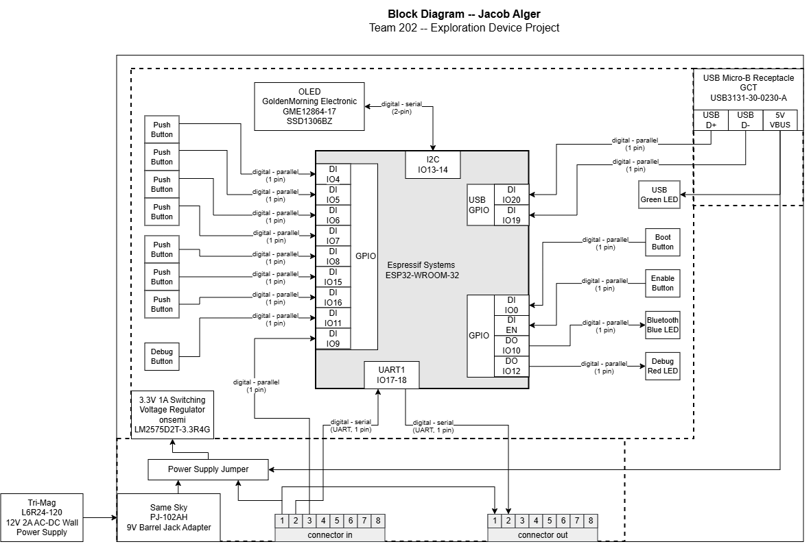

## Overview

This block diagram illustrates the major components of my Human-Machine Interface (HMI) Subsystem, including the connections and signal types used. My subsystem will primarily feature a button array for controlling the rover and an OLED screen for displaying sensor data, parameters, and the status of other subsystems.
  
The subsystem features a DC barrel jack power supply and a power supply jumper to switch to upstream power via the 8-pin connector or to USB power. There are two connectors, an upstream and a downstream, that will send data into and out of my board. The connectors will also be used to share power downstream and provide a common ground for all subsystems.
  
My ESP32 will be programmed via a USB Micro B receptacle, as shown in the Block Diagram. There are the boot and enable buttons required to flash and program the ESP32 microcontroller. The ESP32 is also capable of I2C serial communication with the OLED screen and has plenty of IOs and peripherals, as illustrated in the block diagram.
  
Since I am making the HMI, my subsystem is a separate remote controller from the rover, so it is paired with the Communication subsystem to communicate with the rover using MQTT. The full connection information is available in the Team Block Diagram on the Team 202 Datasheet.
  

## Block Diagram 

> Block Diagram in ["PDF"](../02-Block-Diagram/Individual-Block-Diagram-314-rev3.drawio.pdf) and ["draw.io URL"](https://viewer.diagrams.net/?tags=%7B%7D&lightbox=1&highlight=0000ff&edit=_blank&layers=1&nav=1&title=Individual-Block-Diagram-314.drawio&dark=auto#R%3Cmxfile%3E%3Cdiagram%20name%3D%22Page-1%22%20id%3D%2290a13364-a465-7bf4-72fc-28e22215d7a0%22%3E7V1bc5s6EP41nmkfyEiI62OcpGk7SZPG6e28nCE2sWmxcQE3yfn1R7KRbYSMAUuAU9qZ1ggkxGpX3%2B5qteqhs%2BnzZejMJ9fByPV7Khg999B5T1UR0I0THf8gZS%2BrMkO3VwXj0ButiuCmYOD95yaFICldeCM3Sj0YB4Efe%2FN04TCYzdxhnCpzwjB4Sj%2F2GPjpt86dsZspGAwdn5bSDyDl37xRPEnKoWFvbrx3vfEkebmlmqsbD87w1zgMFrPkjT0VPS7%2FrG5PHdpW8qnRxBkFT1tF6KKHzsIgiFe%2Fps9nrk%2FoSwlH68UvtLc91J%2FEUx9fQPxzefvdjsrrzw3dWSygPedMNz9Pb19%2B3P%2B%2BNE4jfzH6PVbs7Etg5iVLErmkGYBf8jTxYncwd4bk7hNmq3QfHoNZnHAJNMi15%2FtngR%2BEuGAWzFzaTfDH8Rf0K1YFbhi7z1udSL7j0g2mbhy%2B4EcmW8NoUg582hp0AJLuJ%2B0oEKGkJOFv1UqqOQnjjdfNb4iHfyT049NyEvV%2FPivu9a19DU5H09%2FW5PtU0ZB4YmaJN3KiybI6uR%2FFYfBrzfWqMNpCPUtbUwMZ0oIUaS1NGmnVV0NaFXDY1mBIq9lpyiIggLL%2FDYLn7zenk8t3N7G6iKZX778AhTPLHClhdS1LWEvN8CywKWCIpO1HaxahmfJ84xjed%2Bff28%2BTf%2F9RoHjickhl%2BDEhsfcH%2FxyTn%2BgEfcUPwVP8z%2BDJi4cTbzamz%2BEP2XqUU5sWRXNnluqo8XtBgK6%2FQU1luBpm8qI4dGYR%2FdD%2BEu%2FX93wySMrICX%2B9CccPbzC5MT0B%2Fe%2Ft6n9yR9X11cX2j7dvV71KXk%2F7%2BRXrGEQ1UMGdO174TozftvnGVe%2FTX7T304NZ5E49euMhpOVX16pu6ufqvYJJe6ddHguJStKjCgZz5rICImeaAkSOq89YRSQOf2GcFqvVnMTMWpyJzMHjNMOXQ9y6i8v7hF4eVkZPkxtTbzQir%2BHKcVrSWUUpX7Q5XEYaUKJlC4SFoDF%2F3s0DD9Wb6PvB8Be%2Be%2B4549CZ4l%2BKgv%2F56AwD0uqpP3bDrNBscdlDCUms2sl7d9kz%2FDfpn%2BFMCc1nDxH57%2BJ5jgfSib2ASOy5%2B8cbkqnjNgx%2BEqNkq%2FeHElqAVBk8xRYCKkQ79S9VBJLZP%2FX%2BEH2yw%2FEfoAaX%2Fz58%2FrxQDOFAltUCtsUNW2IXBvlbEPIuonnoRpH3SCDvJYrdacRyQGEUuBjcIlX5dndzc60gVeCwIs3MjCviDCvQADNfaqqsgaUcVLOK8oEgl1yFhA%2BWEKj5WFnyLVu4veU9OFsSIHyjKGN3eTOpsryBn4Mq%2BbsDtT%2FcQKRAbT94S8J0nhrNQLoNgXj%2B5OK5eA2aQrjvPsYFufXLoPjscXn74UYuFNjMYKxtHDoYhkWnj0OG437w%2FZP7VQ3H4Xvls6lfm%2FefbEVrZLYQpG%2FvEvldegdHyQg95dopYksVau7KuFM1Zakw5zVYypxpu00CVWKbqqT90zPlnDz8zVky3m3wRPRIMFjM5%2F7Lzo%2BXZaXoIC1Gtog57SyKrPurT45z5Xpz65vxyX7%2FoCTuDXeUcWxnpSpYhEM3RyD1jPSRZgfJZRDGk2AczBz%2FYlPKmCGbZ66CYJ5I5U83jl8S48RZxEFaZnEvw5fvpP6JqtPrH9s3z5%2BT1ldXL8nVqrOxE47dOIdAO4Y0dLGV7%2F1JE403Osuqp2HovGw9MA%2B8WRxttXxLCrY5QNXSnmI74YjNWK%2Fa3Iz8unPVZ1R999i3f0aVPlsMnCkx0wa%2Fds8HBXH59iNWrNXT96%2FOD2Z%2FzbF0tknVd8JwufqHDfdfu%2Bq0%2FWtPR8483rgb6vVs6SxmsAa4EMzgThOGQMzQmsCM7NS%2Fezo8YOo%2FiMi2QCJbjQDzsxd%2F3%2Fr9Y4nRenK1AWVyQTF5C8xTWL5Bbz6WR3gs41OygI8Lhr4TRd6QFr%2Fz%2FN3jnuOHqB3zLTMtwEjXhUI%2BV73RE2FOIiKcB8ohHF9MHp8yvHXlPODpnWvr7ndXh27k%2FZf0hIxuQjncuN7v6ee9lRP0nTP1fEKq967%2FxyUt9dJ%2BbBoAQP14I%2FfRWSynZJ%2F0rr8GkewDHG%2F7OHRGnrtpbXf4QL7l5XszV6GT%2B9KDS2BIzzUKyVdwG2OdwWD%2BvIK%2BMm8ZeWMvdginEE965IYeuViD1%2Brle1UTuX18oypzb%2FZ2T7d2mqxVAJgr7VRWwYmmUtHZOQNkRJypEDw%2BRngiYpFCgCJfaOVJuCJ%2Fc3VxXrdKyzLKZeCP3Nl1EM6W68zgwsezWhjMMB4cqLTL6vD1BVQtQ1Og2ZIeyjekBucQAaP%2FTzOaMxvfAiGjOSNp3ha9mlLHDUNCDXtbzFLeFqoNbjTAH1t3%2BNpguz00gAmLslHKQ8OpAXUtr0ZawSvxxnWnVzyT1MvtSqYpdrV2RfVMU6LUTqOiecMPyGtYEsr5HWXrrqz2LFHyDKsh0TPLih5gnSOla9CVrZ01bD23wn7p3tHFfdItSiTNEpZgrkx3pmBnCso0Bb%2Bc3t0nARSELdtlFgIDopQYa2WNRC2tJCiqJcFq5M8AZdTTpsC2lF%2BwbqzN4iZXYVmxSO24aVoMwsCm9E9rH9ZJVj9RNe1zt%2FnRlHO9jFK3S4jKL5TnbDCoXxmEtpnWu4x9qp2q2Xk15Djam9l%2BwcaxgI%2BL6Ty1ZHlwICnHw2KyUaSqlY4htUTE3PPJLD4qjGqr4eqj96NCkYERHJqnmuutpznRebxoXiQkQI8%2FFuLjSXbQvpAGXtBJKtv7ef5Bup83%2B9IPN4Z8ZytnKtALRZTbEnlQ%2FG6Bjger8mDZFY4aeVBXJfKg2fFga3jQajEP6hJ5UPyScMeDVXmQKEatZUJLIhOKz%2FDRMWFlJmyxRmhAeUyoVlx65DeWzYJTpzt0fbEVXJm3CD8b0SDJREBwSRIfWSKMcu186hWP7OxlnEh8epp8ppK%2B3YLZRGgYaJvRCtQw85b7hC2bJ47Lymt0ardGlwMIR7hGh0fc8X23fat0bVubAyeaDXMwhS%2FnkJFyhZ175K3G8WS6U5aaUpZgi5UlTaKyJD6NXMeEVZmwxVajoH3%2BfB48qo3%2BApJwSA%2FAroF%2Fj5c4H24KpDtpTM4kLtfR7SmS8q9y5e7cfViQbRp3uEUVLPePVKAmJ0sMuz1WNxhzDaITy5JFSfEO%2F8KU7C%2FimOQVk0NGqDIxQKaINF9cItI0q0L8NKhZP83aFVPMT9Mr6CzRSphBIiNumEhnZO3f%2BcCkBUp2Qsjd2ppMlJWdJZQDO2dJ5yz5u5wlCjiBNjJSMqvsm0gycq%2BnU9joTCi0PNeJhESCe%2FH3dhFN6odfJNHu0kRGyVJmel0A3EwcN4TM%2FictWVjNAWC2hlUHAJuHAjB%2Fj2sHwB0Av34AxiaqmgZgVBaAzfRWJFTbTiLUgCuhGQDWgEQA1kQCsPkKARgemqKr8p4Thgv27jlha%2BiwDgC2DgVg%2Ftb6DoBrAeC8xsAu3KsdgIX0so0AbOoojZ%2BlDWAI0hvNdAYpJAJwAx7ohgBY4uq3VjFfD39ImsnCKBmAjWYAmI2%2Bowmzi8fr6VodAGwfCsD8nNodAHcW8Cu3gMEJME3mtMyy%2BKujvPoS0Vf8Zpu2oq%2FE3SJaxTzT%2FCHhBz4fOfq2JFpeLx0tr5uI4Q8Z0fLgUPTlL1p06Nuh7ytHX2z%2BGrZa2uHMhsvX53CWe3Z4ixBX15A8xDUFIi79uNeFuA1lvIRamgsMUIP1asBD8ZO%2F5tDhZ4effwF%2BQljBYVzb9jKNI8SvFDEtiYhpiUTMhnNrykFMuxnEzOzo1sraqAaqw0ZVD8VY%2FrJCh7Edxv4FGGvapZ3CmS3dMk7lyZ3fXz%2FkGqo8yKWRrEIg12h4Ubbd6aw3WYbN7TTDNAdM0Uwv%2FBzYzWxeYk%2BL33usg2nkVujtSZpt7jiqoq5M1%2BahMdgm343T6RfHql90pzqU1zMAsEr7whWztvVmo5nz%2FsiQwfzhODxlAH%2F7PgQqf%2Fd%2BxbcISEzASRpjLv3F%2B3IJSEoxwNHbLEZvsxlwMunG9UOUNj7aF0ehLOOS4ZrzJ20Om1YglZElFeeUQMAguQ4kEUvNEiWPqFVFnIXnhwDbCFOGzpjL3eUfIlNxGPxyt%2B4gA9loxBuGZKCJrABPmN2xHhThJOekOZJBcgGUhZWIqWaJKeKQy7zj%2BI6AltVmixxaPksmLedAhZaSFkkirSaLtJwday0lrSaJtNImV85ehJaSVpdEWksWaTmKf0tJa0giLRSRgIhLM05IUUtpa8qirTQggxzFv6XEtWQRVxqUQQHWVm12lWkT98rmTzrkX56RRTfX7%2BfAIzGzgkVcaZBqtbNgYUOrecFvv6XFO%2ByurdQ8OluLd3pdW4l7dNYW71i2thL36Owt3nljbSXu0VlcvIO02krc47O5eCdEtZW6x2d18QyAtlL3%2BMwuCXnq94Z39fGvOAjwt2YXXMm9XpJUW%2Baq4r5U24YuJtU2n%2BjizxjeS%2FQvA9769mXourM66M1a0Dqb29EQEnzHJ7f4xG40bMh3HwuF7mSGgzcWYk%2FXhpxphT1bm8aFbaLHpa2vVdxzwB%2FQZtLCJYGF9HeRE%2BRk53JtJpONyR4jh1Ib%2B7IVMgcZpCscvEuBvziWQFsRj2Iuz9YbRZg%2FVRxh7F63N6D4aW%2FQSucv1%2FaILm%2FXbV4DQsL5cufk7tCtbR4730b0Gk9%2BU0u%2BtoJ%2BUeg0INNiDwMyoX2iytL0NFukltHMNotGtYwcG7F2LcNgAz3BHi2DrWCYdWgZJU63zeXZTsvotIx6tAxEj16onCPWyKsuUccQv2Wg0zFWCgNoXjMwLImagVExSxA%2F8Jq%2FvewVaQYRVgpijJbBE8Eb34kib0iL33n%2BZk%2FoiD6USAwuSe6XUDBQQwoGuwHY3KdgsBWg2GQLfM4tkQ8%2Fl%2FU7BaNTMOpyY9gHJsE186rLUzAknMH2GhSMg09evvjUAvVCl6he6KpI9aKZlEqvV71o5sAddpXESPLi787awOYb1utQL0rEXeeyfqdedOpFPeqFinJ2fPNli42fkahCiM%2BX1KkQRT6Btw4CSr61Rm1EWqQFUjsGbA0Dqu3lQE3MKcx8HuTsmOl4sCEeJM7%2BtvKgLZEHG4hsvZgtlVZOWGuSyrDJkFbdRicwJyPUYdRuIKS1HwRxW2mNZNJafDwra4nFxGkgZlbl566KQ2cW0Q%2FoL%2B1PuZPvMv4ZXHvDMFDIrzt36M5jZ7gR16qT8uXZfeFncS8QRFBBQAF40lRO6TMPoYRZ2c4ybmYrs8asaSBp22QkHO%2FZKQVVlYK26AQQaBnTyJSoFIgMEOMfc1mTm3bjml0n4W0qPgw1dKIb0NNTl5X4T3MONEeH1jDsOmLKEs6q7JPdcXBg55PtfLKyfLLYukgJCk0IWcBHK98pW%2FVMbH5jWnvm%2Ffys5ut5f52%2FXewpKQdO%2B4etuKJuSCWEeh%2B6VHpY%2BH4DLhv9K2ca%2F4oNNdmacFoPRlY6JBdJS7ShayIFh3%2FY7N8nOKtVl9p1YM1gHKr7FFo2hLF8BauGoAS9xAEQuUzeKcCdAlzTcQuqZqS3RZTQgGmUQrqCRH1YvAf5cFfcVoaKvT4v3ETtrqqMp1QeRAs1VxpNltAmiEbNQDRNeEgBVNuHuMxaUukKeh3bEvRDtyXofPdpB9EdRMuCaGDYaSurNEIr6Y0JCrPEKxGx27h4VgqxldrxGtnMylIVxMaXIYkz2BpNTMnJdTAi09TF%2Fw%3D%3D%3C%2Fdiagram%3E%3C%2Fmxfile%3E) formats.
