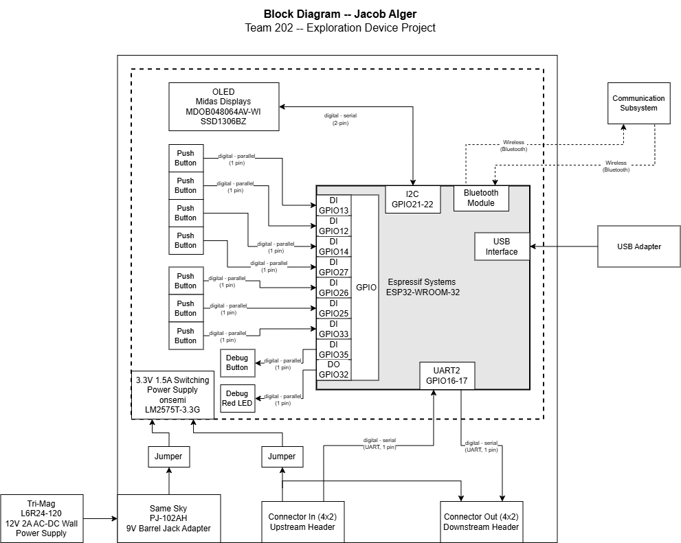

## Overview

This block diagram illustrates the major components of my Human Machine Interface (HMI) Subsystem to show the connections and types of signals used. My subsystem will primarily feature a button array to control the rover and an OLED screen to display sensor data, parameters, and the status of other subsystems.   
The subsystem features a DC barrel jack power supply and jumpers to switch to battery power via the 8-pin connectors. There are two connectors, an upstream and a downstream, that will send data into and out of my board. The connectors will also be used to share battery power and provide a common ground for all subsystems.   
My ESP32 will be programmed via the USB port on the DevKit, as shown in the Block Diagram. The ESP32 is also capable of I2C serial communication with the OLED screen, wireless communication via the built-in module, and other useful peripherals for my subsystem.   
Since I am making the HMI, my subsystem will most likely be a separate controller, so it is also capable of using Bluetooth to communicate with the Communication subsystem. This connection is subject to change as my team learns more about communication systems and how to implement them.   

## Block Diagram 

