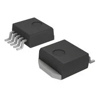
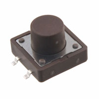
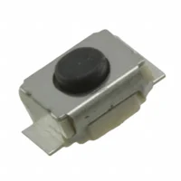

# Major Component Selection

The following sections are the selected major components necessary for my Human-Machine Interface Subsystem. I need to be able to regulate input power using a 3.3-V Switching Regulator from a Barrel Jack Adapter, powered by a Wall Supply AC/DC barrel jack cord. Then, I need to use the regulated 3.3 Volts to power an OLED Screen to display the data and control a microcontroller, which will use I2C to communicate with the OLED and interpret digital inputs from push buttons, allowing the user to control the rover and navigate the menus. The following page details my product selection process of determining which of the three selected components is the best for my subsystem.

*Table 1: Final Summary Table for Active Components Only*

| Component Type | Chosen Component | Price |
|----------------|------------------|-------|
| Switching Voltage Regulator | LM2575D2T-3.3R4G | $2.16 |
| Barrel Jack Adapter | PJ-102AH | $0.59 |
| OLED Screen | GME12864-17 | Given In Class |

## Power Management

### **Switching Voltage Regulator**

#### 1. LM2575-3.3WU-TR

* $1.75/each
* [Link to product](https://www.digikey.com/en/products/detail/microchip-technology/LM2575-3-3WU-TR/1027646)

| Pros | Cons |
|------|------|
| ~1 A buck output; suitable for MCU + display | Low switching freq → large L/C components |
| Wide input range; stable SMPS regulation | Requires 1N5822 Diode; Low supply on Digikey |
| Good efficiency vs. linear regulators | Higher quiescent current than modern parts |

#### 2. LM2675MX-3.3/NOPB

* $4.80/each
* [Link to product](https://www.digikey.com/en/products/detail/texas-instruments/LM2675MX-3-3-NOPB/366907)

| Pros | Cons |
|------|------|
| Higher freq (~260 kHz) → smaller passives | Needs external L, diode, caps |
| ~1 A regulated 3.3 V output | EMI/layout sensitivity |
| Better efficiency than linear solutions | Non-synchronous → lower light-load efficiency |

#### 3. LTC3621EMS8E-3.3#PBF

* $8.17/each
* [Link to product](https://www.digikey.com/en/products/detail/analog-devices-inc/LTC3621EMS8E-3-3-PBF/4840601)

| Pros | Cons |
|------|------|
| Wide Vin (~2.7–17 V), ~1 A output | Limited scalability beyond ~1 A |
| Synchronous, very low IQ, high efficiency | More complex control/features |
| High freq (≈1–2.25 MHz) → very small passives | Higher cost vs. legacy regulators |

#### 4. LM2575D2T-3.3R4G

* $2.16/each
* [Link to product](https://www.digikey.com/en/products/detail/onsemi/LM2575D2T-3-3R4G/1476688)

| Pros | Cons |
|------|------|
| ~1 A buck output; suitable for MCU + display | Low switching freq → large L/C components |
| Wide input range; stable SMPS regulation | Requires careful PCB layout & filtering |
| Good efficiency vs. linear regulators | Higher quiescent current than modern parts |

#### Selection

*Choice:* **LM2575D2T-3.3R4G**

***Rationale:*** I have selected the LM2575D2T-3.3R4G because it is not only one of the least expensive options but also provides everything I need from a voltage regulator. It will need the capacitors and inductors that the switching voltage regulator we used in class needed, but that should not be a problem, as I can duplicate my previous work on my subsystem. The other voltage regulators required inductors and diodes that were hard to source, so this option, which matches the components we used in class, is the best fit.

### **Barrel Jack Adapter**

#### 1. FC68148S

* $1.55/each
* [Link to product](https://www.digikey.com/en/products/detail/cliff-electronic-components-ltd/FC68148S/20374233)

| Pros | Cons |
|------|------|
| Common 5.5 mm/2.1 mm DC input | ~2 A current limit |
| SMT footprint → compact PCB | SMT weaker mechanically than TH |
| Suitable for low-power 12 V systems | 12 V-class only |

#### 2. FC68148ST

* $0.90/each
* [Link to product](https://www.digikey.com/en/products/detail/cliff-electronic-components-ltd/FC68148ST/26794679)

| Pros | Cons |
|------|------|
| Standard 2.1 mm, ~12 V/2 A rating | Same ~2 A limit |
| SMT, compact, automated assembly | Reduced mechanical robustness |
| Defined insertion force → predictable feel | Basic connector; no locking/high-power features |

#### 3. PJ-102AH

* $0.59/each
* [Link to product](https://www.digikey.com/en/products/detail/same-sky-formerly-cui-devices/PJ-102A/275425)

| Pros                          | Cons                                           |
| ----------------------------- | ---------------------------------------------- |
| Standard 2.0mm × 5.5mm Diameter | Can stress PCB mechanically if unplugged often  |
| Provided in Lab Kit           |  
| Works with most wall adapters (also provided in Lab Kit) |
| Through-Hole, good for PCB mounting |

#### Selection

*Choice:* **PJ-102AH**

***Rationale:*** When researching barrel jack adapters, there were few options for surface-mount adapters that met the specifications I required. From the surface-mount options, the FC68148S appears to be the best. However, through-hole is generally better for connections, so I am going to go with the barrel jack I used last semester, the PJ-102AH. It is capable of everything I will need for this subsystem, and I know it is reliable.

### **Power Supply**

#### 1. DDU120150R

* $10.53/each
* [Link to product](https://www.digikey.com/en/products/detail/jameco-electronics/DDU120150R/25966445)

| Pros | Cons |
|------|------|
| 12 V, 1.5 A (18 W) → enough for 3.3 V rail | 120 VAC-only input |
| Safety-approved wall adapter | Limited power headroom |
| Standard 2.1 mm barrel + long cable | Narrow temp range (≈-10 → 40 °C) |

#### 2. L6R24-120

* $10.38/each
* [Link to product](https://www.digikey.com/en/products/detail/tri-mag-llc/l6r24-120/7682639)

| Pros | Cons |
|------|------|
| Higher power (~24 W) margin | Still low-power class supply |
| Universal 90–264 VAC + DOE VI efficiency | Fixed wall-adapter form factor |
| Compact, safety & EMI compliant | Indoor-type temp limits |

#### 3. WDU12-1900

* $49.93/each
* [Link to product](https://www.digikey.com/en/products/detail/triad-magnetics/WDU12-1900/6819555)

| Pros | Cons |
|------|------|
| Highest output (~12 V, 1.9 A ≈ 33 W) | 120 VAC-only input |
| Enclosed external supply → low noise/heat on PCB | Linear-style → lower efficiency |
| Standard center-positive DC output | Larger/heavier form factor |

#### Selection

*Choice:* **L6R24-120**

***Rationale:*** The L6R24-120 power supply is very similar to the one provided in the lab kits, so I feel that it is the most logical choice if I don't end up simply using the one in my lab kit. It is also the least expensive option, which is valuable for keeping my subsystem within budget.

## Actuators

### **OLED Screens**

#### 1. MDOB128064V2V-WI

* $11.03/each
* [Link to product](https://www.digikey.com/en/products/detail/midas-displays/MDOB128064V2V-WI/20841734)

| Pros | Cons |
|------|------|
| 128×64 resolution → clear UI graphics | Controller compatibility must match |
| Low OLED power draw (few–10s mA) | Current rises with brightness/pixels |
| High contrast, wide viewing angle | Needs proper biasing/passives |

#### 2. GME12864-17

* Given In Class, Not Currently Being Sold
* [Link to product](https://goldenmorninglcd.com/oled-display-module/0.96-inch-128x64-ssd1306-gme12864-11/)

| Pros | Cons |
|------|------|
| 3.3–5 V operation flexibility | Power varies with brightness/content |
| I²C/SPI/parallel interface options | Limited temp range vs. industrial |
| Manageable ~20 mA typical current | Monochrome-only UI |
| Worked with in class, able to confirm function | |

#### 3. MDOB048064AV-WI

* $7.38/each
* [Link to product](https://www.digikey.com/en/products/detail/midas-displays/MDOB048064AV-WI/18088029)

| Pros | Cons |
|------|------|
| Very small (~0.7″) compact module | Low resolution (48×64) |
| Wide temp range (-40 → 80 °C) | Monochrome passive-matrix limits UI |
| Simple 3 V I²C SSD1306 interface | Small viewing/active area |

#### Selection

*Choice:* **GME12864-17**

***Rationale:*** The GME12864-17 is the OLED screen given to us in class, and the one we will be proving proficiency with in the labs, so it is a logical option for my subsystem; however, the MDOB128064V2V-WI is a very similar option that is larger, and more importantly, has an easily obtainable datasheet on DigiKey, which is critical for this project. I will move forward with GME12864-17, as I know how to make it work and can find datasheets for similar models, which should be sufficient, since I will just be using header pins to connect the screen to my board.

### **Push Buttons**

#### 1. TSSLE 6868 R WNN

* $3.38/each
* [Link to product](https://www.digikey.com/en/products/detail/knitter-switch/TSSLE-6868-R-WNN/22607895)

| Pros | Cons |
|------|------|
| IP67 sealed; outdoor-capable | Low electrical rating (~50 mA) |
| Long life (~300k presses) | Higher actuation force (~2 N) |
| Illuminated SMT switch | More complex/costly than basic tactile |

#### 2. KP0415ASG03RGBP-2SJB

* $14.85/each
* [Link to product](https://www.digikey.com/en/products/detail/nkk-switches/KP0415ASG03RGBP-2SJB/16351342)

| Pros | Cons |
|------|------|
| Integrated RGB + white illumination | Signal-level current only (~100 mA) |
| Compact SMT tactile pushbutton | Requires LED drive/current limiting |
| MCU-friendly low-voltage ratings | Higher cost & design complexity |
| | Low Stock on DigiKey |

#### 3. K12SC S 1.5 5N O LFTX

* $4.05/each
* [Link to product](https://www.digikey.com/en/products/detail/c-k/K12SC-S-1-5-5N-O-LFTX/7056014)

| Pros | Cons |
|------|------|
| SPST-NO, 0.1 A @ 30 V capability | No illumination |
| Wide temp range (-40 → 85 °C) | Low current → signal-only use |
| Compact SMT, ~100k life | High actuation force (~5 N) |

#### 4. TL3300CF160Q

* $0.60/each
* [Link to product](https://www.digikey.com/en/products/detail/e-switch/TL3300CF160Q/2498433)

| Pros | Cons |
|------|------|
| Large Size  | More Space on PCB |
| Inexpensive | No illumination |
| Low Operating Force (160 gf) |  |

#### 5. B3U-1000P

* $0.90/each
* [Link to product](https://www.digikey.com/en/products/detail/omron-electronics-inc-emc-div/B3U-1000P/1534338)

| Pros | Cons |
|------|------|
| Simple SPST | Small Size |
| 2 Solder Joints | Hard to push actuator |
| Inexpensive | No illumination |

#### Selection

*Choice:* **TL3300CF160Q** & **B3U-1000P**

  

***Rationale:*** The pushbuttons are uniquely hard to compare and search for, as they are based far more on form and feel than on pure specifications; however, I feel that the TL3300CF160Q is the best one, as it is not only large but also easy to push. This will make the HMI far easier to use, as the user will not need to use their fingernails to push the buttons, and should be able to use them without looking to orient their finger placement. The B3U-1000P is also selected specifically for the boot, enable, and debug buttons for my PCB. The user will not interface with these; they are strictly for my use, which makes their tiny size and simple features a positive for their role on the board.

