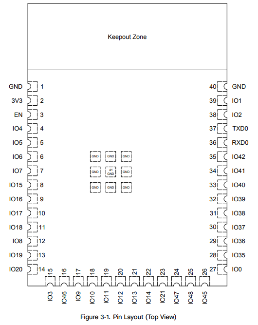

## Selected Microcontroller

* Peripherals Needed: I2C, UART, GPIO (~10), USB, Bluetooth
* **ESP32-S3-WROOM-1-N4**: 36 GPIOs, *“ESP32-S3 integrates a rich set of peripherals including SPI, LCD, Camera interface, UART, I2C, I2S, remote control, pulse counter, LED PWM, USB Serial/JTAG, MCPWM, SD/MMC host controller, TWAI® controller (compatible with ISO 11898-1, i.e., CAN Specification 2.0), ADC, touch sensor, and temperature sensor. It also includes a full-speed USB 2.0 On-The-Go (OTG) interface to enable USB communication.”*

*Table 1: ESP32 Info*
| ESP Info                                      | Answer | Help  |
| --------------------------------------------- | ------ | ------------------------------------------------------------------------------------------------------- |
| Model                                         | ESP32-S3-WROOM-1-N4      |   |
| Product Page URL                              | [Espressif.com](https://www.espressif.com/en/module/esp32-s3-wroom-1-en)      |          |
| ESP32-S3-WROOM-1-N4 Datasheet URL             | [Datasheet PDf](https://documentation.espressif.com/esp32-s3-wroom-1_wroom-1u_datasheet_en.pdf)      |   |
| ESP32 S3 Datasheet URL                        | [Datasheet PDF](https://documentation.espressif.com/esp32-s3_datasheet_en.pdf)      |  |
| ESP32 S3 Technical Reference Manual URL       | [Manual PDF](https://documentation.espressif.com/esp32-s3_technical_reference_manual_en.pdf)      |     |
| Vendor link                                   | [Digikey](https://www.digikey.com/en/products/detail/espressif-systems/ESP32-S3-WROOM-1-N4/16162639)      |    |
| Code Examples                                 | ?      | url(s) for libraries on github or other sites related to the microcontroller and your planned peripherals |
| External Resources URL(s)                     | ?      | Search on Google and YouTube for other resources for each specific microcontroller.   |
| Unit cost                                     | $5.06     |    |
| Absolute Maximum current   (for entire IC)        | 1.5 A or 1500 mA      |  |
| Supply Voltage Range                          | 0.3V / 3.3V / 3.6 V      |   |
| Maximum GPIO current   (per pin)           | 40 mA      |  |
| Supports External Interrupts?                 | Yes      | |
| Required Programming Hardware, Cost, URL      | ?      |  |

## Subsystem Explanation

## Chip Compatibility

* HMI: OLED - ESP32 can handle since we are using it in class. Should be able to use any OLED with I2C and appropriate libraries.

## Pinout Diagram and Table

**Figure 1: Pinout Diagram sourced from ESP32-S3-WROOM-1-N4 Datasheet.**

*Table 2: Peripherals and Pins*
| Peripheral               | Pins Used                                                                 | Notes |
|---------------------------|--------------------------------------------------------------------------|-------|
| UART0                     | RXD0 (36), TXD0 (37)                                                     | Default hardware UART0 RX/TX on module; used for serial console/programming by default. UART0 hardware flow control can map to IO15/IO16 via IO MUX but is generally routed via the GPIO matrix if needed. |
| UART1                     | IO17 (10), IO18 (11), IO19 (13), IO20 (14)                               | UART1 signals are available on these pins via IO MUX by default (TX/RX/RTS/CTS). All UARTs can also be reassigned via GPIO Matrix to almost any GPIO. |
| UART2                     | No fixed pins                                                             | UART2 does not have default mapped pins in the module; must be assigned via GPIO Matrix. |
| I2C (I2C0/I2C1)           | Any GPIO pins via GPIO Matrix                                             | Two I2C interfaces; no fixed SDA/SCL — choose via GPIO Matrix. |
| SPI0 / SPI1 (Flash/PSRAM) | Module internal (not exposed as general GPIO)                             | SPI0 and SPI1 are connected to flash/PSRAM in package; these signals (e.g., SPICLK, SPIQ, etc.) are on pins such as IO8–IO15 and IO46–IO48 but are not recommended for general peripherals. |
| SPI2 (Host SPI)           | Any GPIO pins via GPIO Matrix                                             | Available as general SPI; assign MOSI/MISO/SCLK/CS via GPIO Matrix. |
| SPI3                      | Any GPIO pins via GPIO Matrix                                             | General SPI available for use; assign via GPIO Matrix. |
| ADC (SAR ADC1 / ADC2)     | IO0, IO1, IO2, IO3, IO4, IO5, IO6, IO7, IO8, IO9, IO10, IO11, IO12, IO13, IO14, IO15, IO16, IO17, IO18, IO19, IO20 (multiplexed) | Two 12‑bit SAR ADCs; analog functions are multiplexed with GPIOs 0–20. For ADC2 when Wi‑Fi is active, ADC2 channels may not be usable. |
| USB OTG (integrated)      | GPIO19 (13) USB_D‑, GPIO20 (14) USB_D+                                    | USB OTG data signals are multiplexed with GPIO19/20; see datasheet for USB Serial/JTAG options. |
| LED PWM (LEDC)            | Any GPIO pins via GPIO Matrix                                             | PWM channels can be output on virtually any GPIO. |
| Motor PWM (MCPWM)         | Any GPIO pins via GPIO Matrix                                             | MCPWM channels are assignable via GPIO Matrix. |

