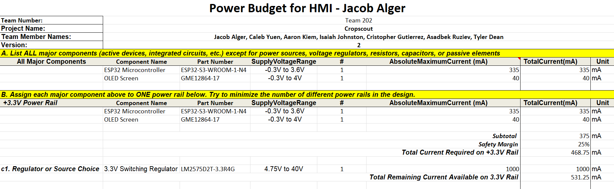
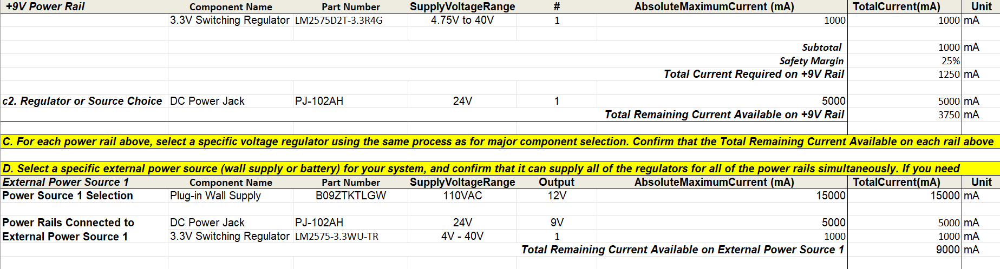

## Overview

To ensure that my selected components will still work in the worst-case scenario and to size the fuse in my subsystem, I prepared the following power budget, shown in **Figure 1** below. The power budget showcases every major component, its absolute maximum current draw, and the power rail it's on (with its associated voltage regulator).

{style width:"350" height:"300;"}
 
{style width:"350" height:"300;"}
**Figure 1: Power budget for Human-Machine Interface Subsystem**

## Conclusions

From the prepared power budget, it is evident that I have excess current. This makes sense, as my subsystem consists mainly of control buttons, which are passive components and don't draw any meaningful current. The only components that draw considerable current are the screen and the microcontroller, which don't draw very much. This shows to me that I need a fuse of around 0.5 Amps, or potentially 0.75 to account for any spikes from the 9V rail. For my design, I selected an 800 mA fuse because it is a common size and is easy to see to protect all of my subsystems in the event of a surge. This also shows that I have plenty of current available if I am to connect power downstream to the communication subsystem, and if we include a battery pack, we should be able to provide a long battery life, but that is currently undecided, so I did not include the battery section of the power budget.

## Resources

The power budget as a PDF download is available [*here*](EGR314_Power_Budget-rev2.pdf), and a Microsoft Excel Sheet [*here*](EGR314-Power_Budget.xlsx).
