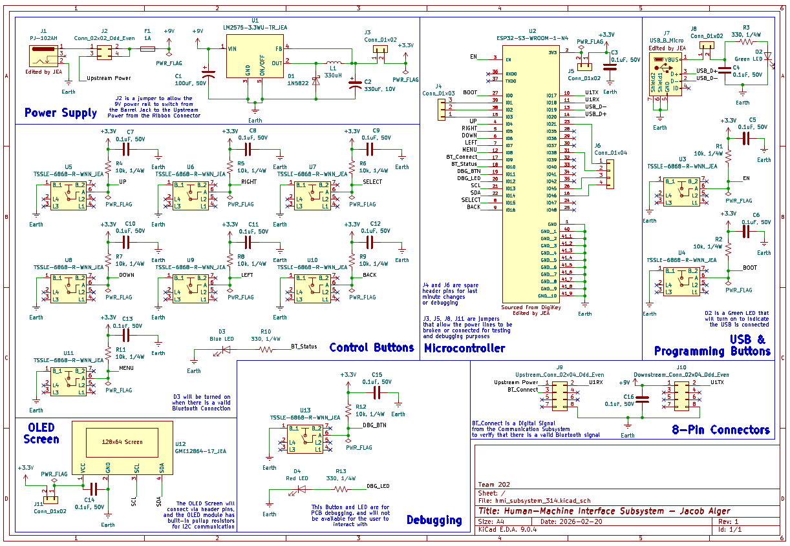

## Overview

This schematic is design to support .... (highlight functionally, power, and controller).

{style width:"350" height:"300;"}
**Figure 1:** Human-Machine Interface Schematic.

## Resouces

The schematic as a PDF download is available [*here*](hmi_subsystem_314.pdf), and the Zip folder of the project [*here*](hmi_subsystem_314-rev1.png).
