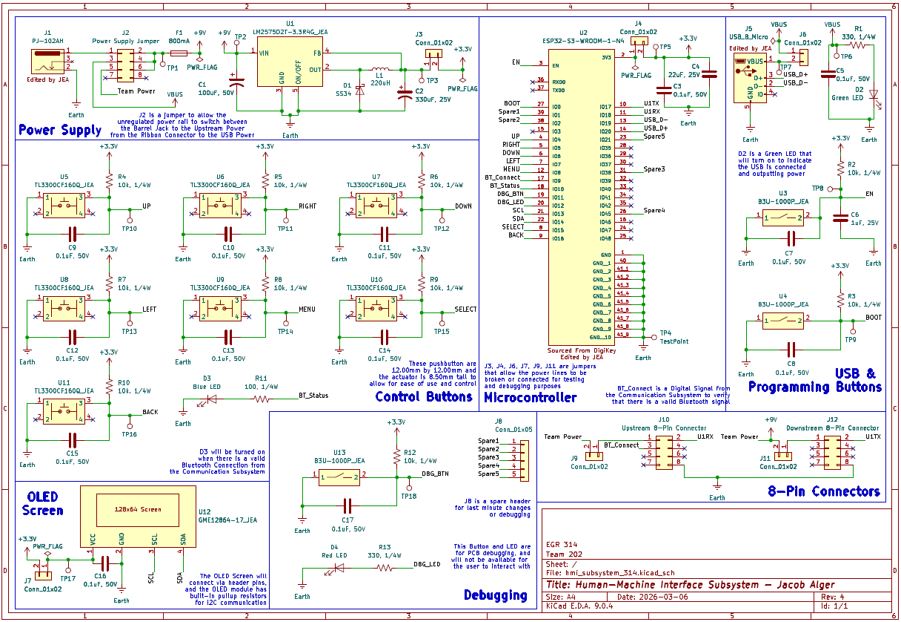

## Overview

The schematic shown in **Figure 1** is for my Human-Machine Interface subsystem. It consists of a power supply, a microcontroller, a USB port, control buttons, debugging tools, an OLED screen, and headers for connection. The power supply features a barrel jack and a switching voltage regulator to deliver 3.3 Volts to the entire system. There is also a surge-protection fuse and a jumper that allows switching the input power from the barrel jack to the upstream power supply via the 8-pin ribbon connector. The USB section features a USB micro-B receptacle (with status LED) and the boot and enable buttons required to program the microcontroller. The microcontroller section features the pinout for the ESP32-S3-WROOM-1-N4, which I covered in the microcontroller selection section, including every net label for the IOs. There are also spare headers for debugging and quick fixes I may need later. The control buttons feature 7 buttons for controlling the rover and the OLED screen menus. The OLED screen will use I2C to transmit the rover's data to the user.

Overall, the schematic covers every aspect of my subsystem that will be needed, both for basic functionality and for debugging/programming. Please view the schematic in **Figure 1**and the PDF or project ZIP files in the *Resources* section below.

{style width:"350" height:"300;"}
**Figure 1:** Human-Machine Interface Schematic.

## Resouces

The schematic as a PDF download is available [*here*](hmi_subsystem_314-rev4.png), and the Zip folder of the project [*here*](hmi_subsystem_314-rev4.zip).
