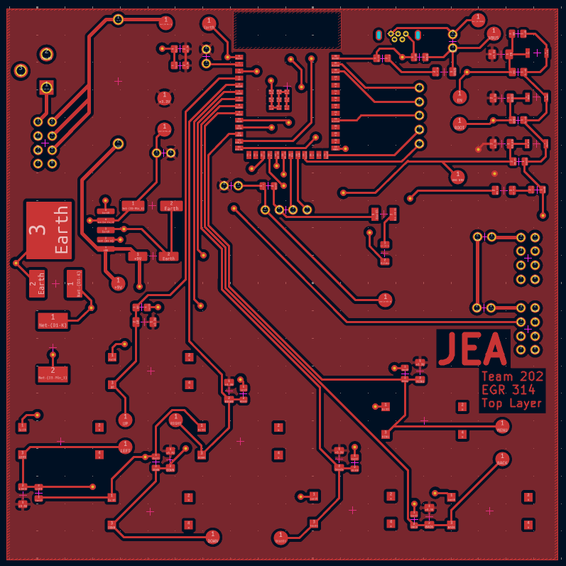
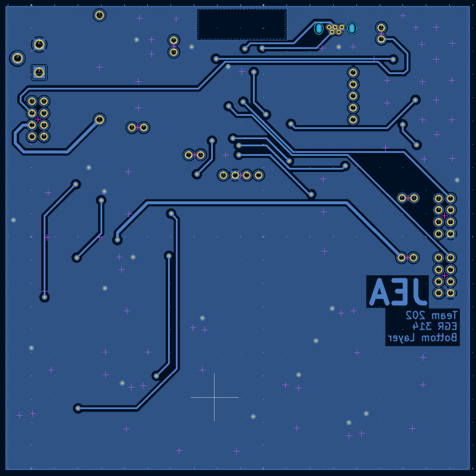
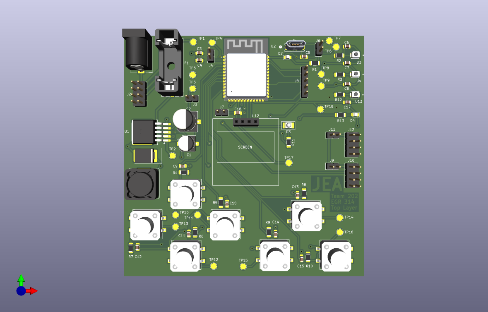
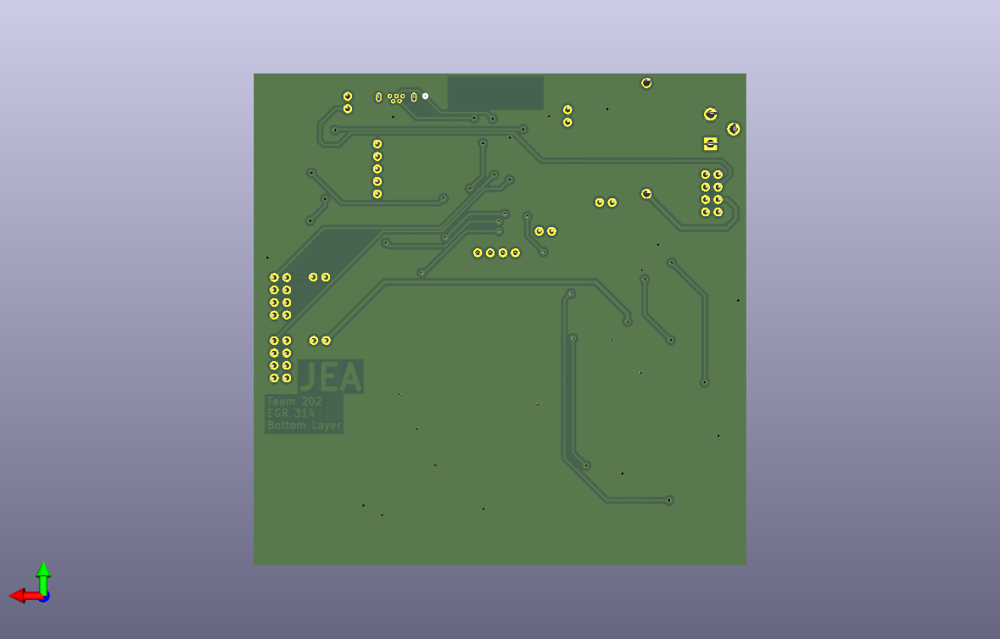
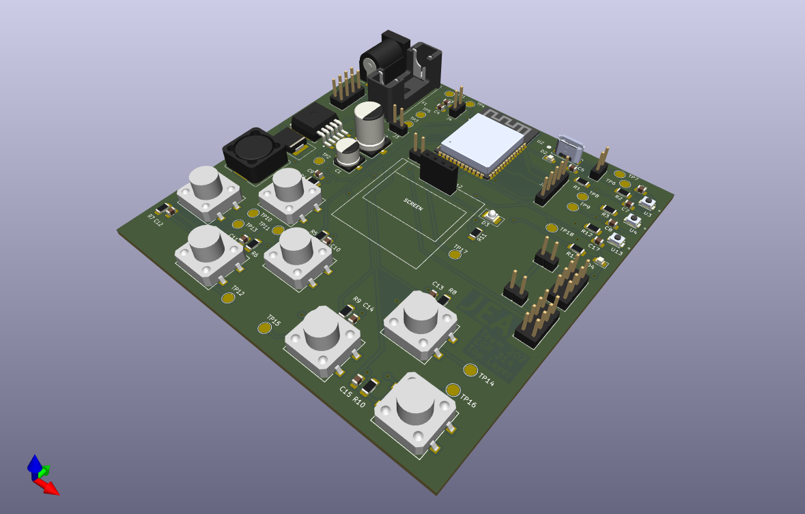
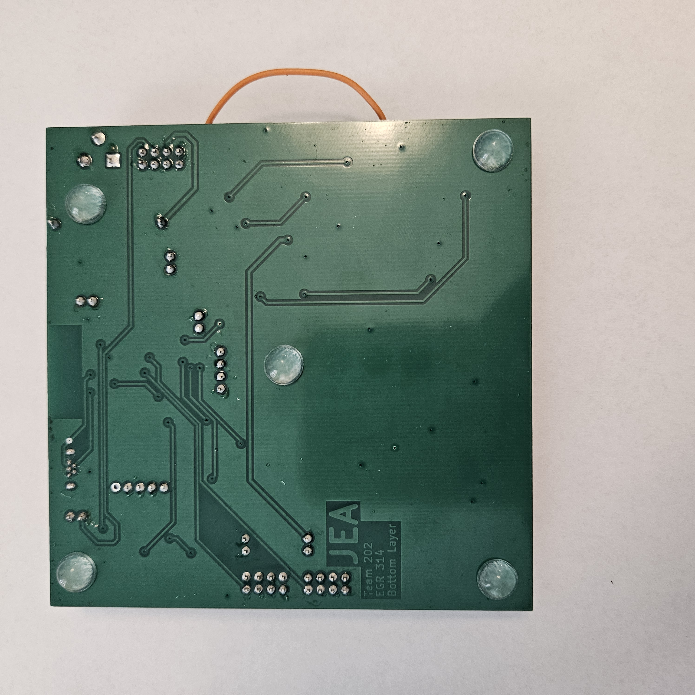
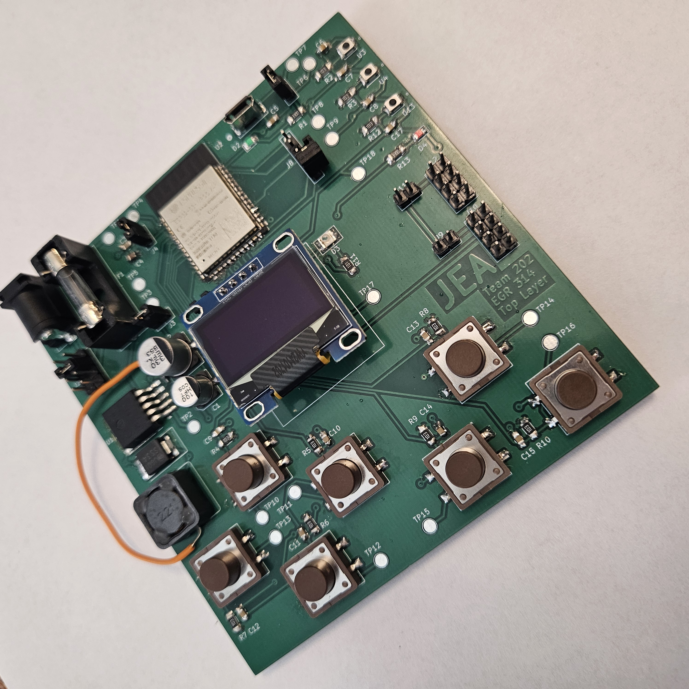

## PCB

After ordering the parts I needed from DigiKey and ordering my board from JLCPCB, I soldered each component to the PCB. I messed up the first board I made by ripping up the D+ pad on the ESP32 footprint, and I similarly ripped up a pad on my inductor during my second attempt, but I was able to save the board, as shown in **Figure 6** below. I utilized flux, solder paste, solder wick, and a reflow gun to get everything soldered, and I learned a lot about the issues that come from overheating a board and selecting parts that are hard to solder by hand (the 0805 capacitors and the inductor). 

After soldering everything together to my board, I tested that my voltage regulator worked, and that my ESP was programmable. I created code to test each button press and display them on the OLED screen, demonstrating that I can do everything I need for the Human-Machine Interface of the CropSCOUT rover.

> You can view a PDF of all of the following pictures, the Gerber files used to manufacture my board, and the test code I used to verify functionality of my board below in the *Resources* section.

Below are the KiCad front and bottom copper layers of my board, where all my traces reside **(Figures 1 & 2)**. I learned to use vias, which proved very useful in designing this PCB.

**Figure 1: KiCad Top Layer of the PCB**

**Figure 2: KiCad Bottom Layer of the PCB**

Below is the KiCad 3D viewer of my PCB, which I found useful for spacing components on my board **(Figures 3, 4, & 5)**. I used the STL files provided by DigiKey and preinstalled in KiCad to generate a 3D model for each footprint.

**Figure 3: KiCad 3D Viewer Top Layer of the PCB**

**Figure 4: KiCad 3D Viewer Bottom Layer of the PCB**

**Figure 5: KiCad 3D Viewer Isometric View of the PCB**

Below are pictures I took of my completed PCB, which I verified to show that the voltage is properly regulated and that my ESP32 is programmable **(Figures 6, 7, & 8)**. You can see the wire I had to add to fix the ripped-up pad of the inductor, and the jumpers that I am storing on my currently unused spare headers. I also found that pin 39, the Spare1 header pin, was bridged to ground (pin 40) after using the reflow gun on the ESP32. This didn't cause any issues, but I chose not to solder a header pin to that GPIO so I wouldn't accidentally use it.

**Figure 6: Picture of the Top of my PCB**

**Figure 7: Picture of the Bottom of my PCB**

**Figure 8: Picture of an Isometric view of my PCB**

## Resources

The PCB layers PDF is available [*here*](hmi_subsystem_314_pcb.pdf), the Gerber ZIP folder is available [*here](JacobAlger202.zip), and the Test Code ZIP folder is available [*here*](esp32-test-code.zip).
