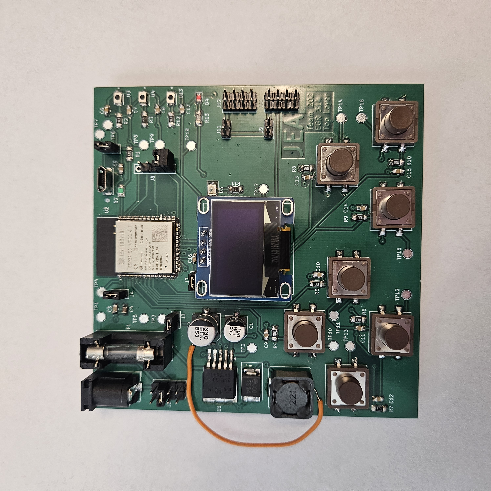
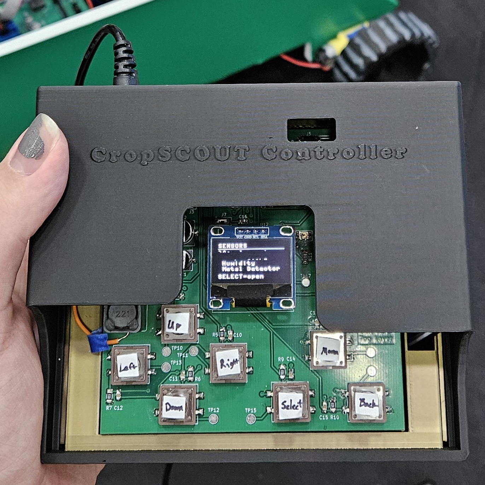

Jacob Alger's Datasheet 
as part of 
 Exploration Device Project: 
 CropSCOUT 
for 
 **Team 202**  
 *S.C.O.U.T.S*  
 *Super Cool Original and Unique Technology Systems*    

**Submission: May 4, 2026**

| {: width=300px height=300px} | {: width=300px height=300px} |
|-------------------------------------------------------------|----------------------------------------------------------------|
| **Picture of Final PCB Design**                             | **Picture of Controller at Innovation Showcase**               |

## Introduction

This datasheet serves as a collection of my individual work toward this project. It includes each step of development for my subsystem, which is the Human-Machine Interface for the Exploration Device, the CropScout. I will frequently shorten Human-Machine Interface to HMI throughout this datasheet, so please be aware of what I mean when I say HMI. Below you can view a project summary, my contribution to the project, and navigation to both my team's datasheet and the sections of this datasheet.

### Project Summary

Team 202 was tasked with developing a functional prototype of an exploration device that is capable of navigating and sensing its surroundings. We were given free rein to choose the kind of exploration device we wanted to develop, whether a submarine, a drone, or a rover. We were also allowed to select the exploration environment, and as a team, we decided to develop an earth-based rover that farmers or landowners with large plots could use to track or survey their land. We decided, after a concept selection process, to create the CropScout, a rover with a controllable arm equipped with sensor probes. This rover would be accompanied by a controller that can instruct the sensors to collect data, display it to the user, and allow the user to steer the rover and position its arm. I was tasked with developing the controller, specifically the Human-Machine Interface.

> View the Team 202 Team Report [*here*.](https://egr314-s-2026-202.github.io/)

### My Contribution

The Human-Machine Interface allows the user to control and interact with the rover. The HMI must include an OLED screen, as specified in the project description, to allow the user to read sensor data and monitor the device's status. To allow the user to control the OLED, a pushbutton array will be needed to select and navigate the screen and read the data. The HMI subsystem will need to communicate with the rover, so our team decided to make the HMI a separate subsystem, along with the Communication subsystem, from the rover. The HMI will communicate via an 8-pin ribbon cable connected to the Communication subsystem; the Communication subsystem will then wirelessly communicate with the rover to not only read sensor data but also drive the rover.

To view the pages of this datasheet, which detail the process I went through to develop the HMI, you can you the above navigation bar (which has a scroll bar to see every page), or the following links to each page:

* To see the individual requirements for my subsystem, view the [*Requirements Page*.](https://jacob-alger.github.io/Jacob-Alger-314.github.io/01-Requirements/Requirements/)
* To see the block diagram for my subsystem, view the [*Block Diagram Page*.](https://jacob-alger.github.io/Jacob-Alger-314.github.io/02-Block-Diagram/Block-Diagram/)
* To see the component selection process, view the [*Component Selection Page*.](https://jacob-alger.github.io/Jacob-Alger-314.github.io/03-Component-Selection/Component-Selection/)
* To see the microcontroller selected, view the [*Microcontroller Selection Page*.](https://jacob-alger.github.io/Jacob-Alger-314.github.io/04-Microcontroller-Selection/Microcontroller-Selection/)
* To see the calculated power budget for my subsystem, view the [*Power Budget Page*.](https://jacob-alger.github.io/Jacob-Alger-314.github.io/05-Power-Budget/Power-Budget/)
* To see the bill of materials for my entire subsystem, view the [*BOM Page*.](https://jacob-alger.github.io/Jacob-Alger-314.github.io/06-BOM/BOM/)
* To see my schematic for my subsystem, view the [*Schematic Page*.](https://jacob-alger.github.io/Jacob-Alger-314.github.io/07-Schematic/schematic/)
* To see my API for the communication protocols across the system, view the [*API Page*.](https://jacob-alger.github.io/Jacob-Alger-314.github.io/08-API/API/)
* To see my Printed Circuit Board design and population process, view the [*PCB Page*](https://jacob-alger.github.io/Jacob-Alger-314.github.io/09-PCB/pcb/)
* To see what I would do if I were to redo this project, view the [*Hardware V2.0 Page*](https://jacob-alger.github.io/Jacob-Alger-314.github.io/10-Hardware-V2-0/Hardware-V2-0/)
* To see my code, CAD files, and presentation videos, view the [*Resources Page*](https://jacob-alger.github.io/Jacob-Alger-314.github.io/11-Resources/Resources/)
* To see my reflection of this project and class, view the [*Reflection Page*](https://jacob-alger.github.io/Jacob-Alger-314.github.io/12-Reflection/Reflection/)
